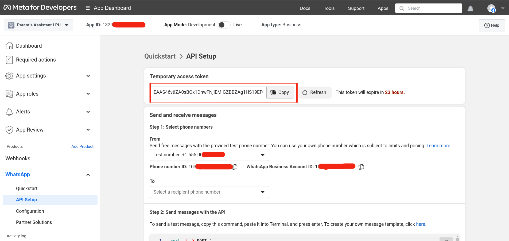
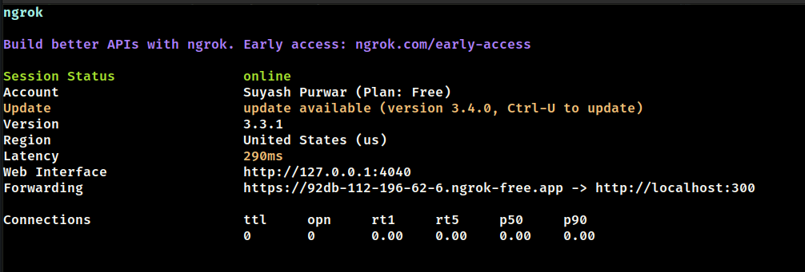
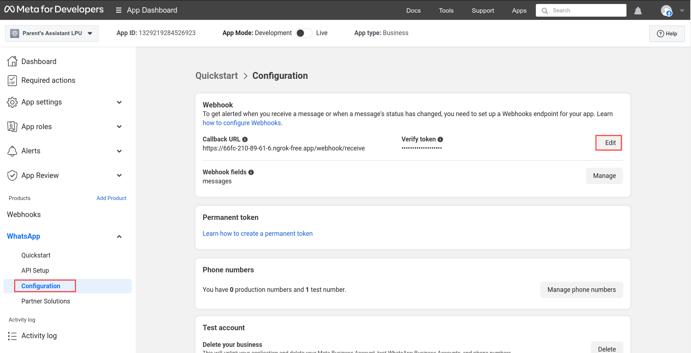
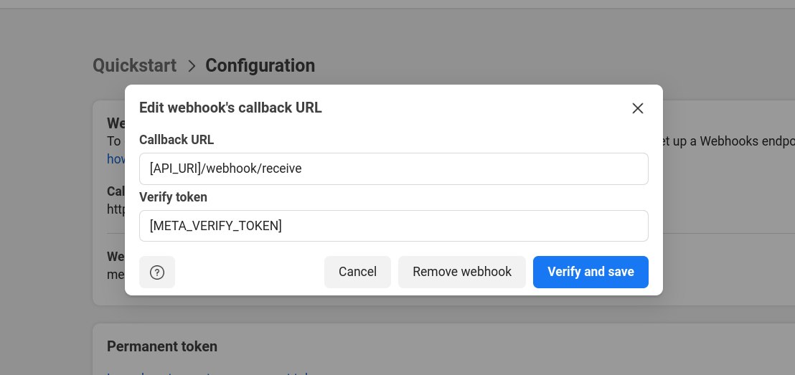
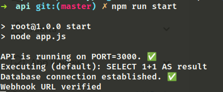

# Ayra 🤖


## 0. Table of Contents

1. [Overview](#1-overview)
2. [Install](#2-install)
3. [How it works?](#3-how-it-works)
4. [Future Ideas](#4-future-ideas)
5. [References](#5-references)

## 1. Overview

Ayra is a natural language language bot that lives in your WhatsApp. It assists parents of college students by offering an accessible and intuitive platform to monitor their child's performance and receive important updates from their institutions. Currently, the bot can communicate in English and Hinglish, but it only responds in English.

## 2. Install

### 2.1 Requirements

1. Node.js version 17+
2. Ngrok
3. PostgreSQL (if setting up locally)
4. [.env file](#22-env-file)

### 2.2 `.env` file

To setup this project locally, you’ll need a `.env` file with following set of variables.

```env
API_PORT=3000
API_URI=                   # Changes everytime the project starts locally.

META_API_URI=
META_VERIFY_TOKEN=         # Changes every 24 hours.
META_ACCESS_TOKEN=
META_PHONE_ID=

# OpenAI API
OPENAI_ACCESS_TOKEN=
OPENAI_MODEL_NAME=         # Name of the fine-tuned model

# Database
POSTGRES_HOST=
POSTGRES_PORT=
POSTGRES_DB_NAME=
POSTGRES_DB_USER=
POSTGRES_DB_PASSWORD=
```

Reach out to me via my [email](mailto:suyashpurwar4035@gmail.com) to get a copy of this file. `META_VERIFY_TOKEN` refreshes every 24 hours. So, you'll need access of the Meta for Developers dashboard too.

### 2.3 Setting up locally

1. Clone the repository locally and move inside the folder.

```bash
git clone https://github.com/Suyash-Purwar/ayra.git
cd ayra
```

2. Paste the `.env` file given by me. You'll need to generate the values of two variables - `META_VERIFY_TOKEN` and `API_URI`. Keep the rest of the variables as is.

3. Get the `Temporary Access Token` from the dashboard. Notice that it expires after a day. You'll be able to access the dashboard for this app once I provide the login credentials.



Copy the token and put in the `META_VERIFY_TOKEN` in the `.env` file like this.

```bash
META_VERIFY_TOKEN=EAAS46vt...
```

3. Setup HTTP tunnel

Create an HTTP tunnel forwarding to to the local port on which the Ayra API is running (`API_PORT`).

Creating the tunnel without specifying the `region=us` fails at times. So, do add that parameter.

Run the following command in your terminal. Ngrok must be installed in your system for this to work.

```bash
ngrok http 3000 --region=us
```

You should see something like this after running the above command. The Forwarding URL (in the image below) is of special interest to us.



4. Copy and paste the Forwarding URL in `API_URI` in the `.env` file.

```bash
API_URI=https://92db-112-196-62-6.ngrok-free.app
```

5. Start the server

```bash
npm run start:dev
```

6. Go to the Meta for Developers dashboard. Click on the Configuration option button in the sidebar.



Press on the `Edit` button on the right side of the screen. A dialog box will open us. Replace the `API_URI` part with ngrok url obtained in the previous step. Keep the following `\webhook\receive` part as it is.

In the `.env` file, there's a variabled named `META_VERIFY_TOKEN`. Place it's value in the second input field. Press `Verify and Save` button.



Upon successful verification, you should see something like this in your terminal. This concludes the installation setup.



## 3. How it works?

## 4. Future Ideas

## 5. References
