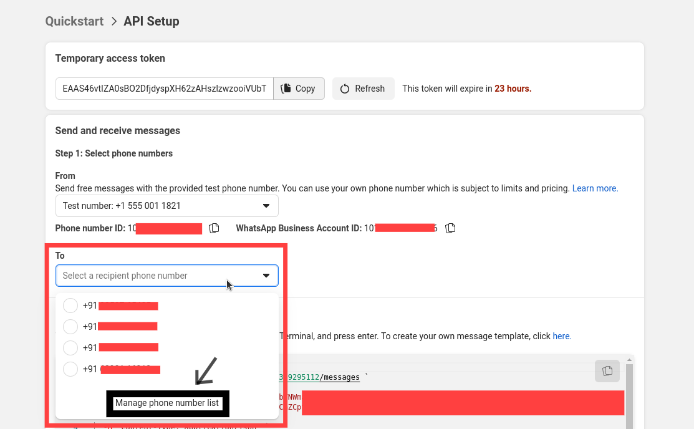
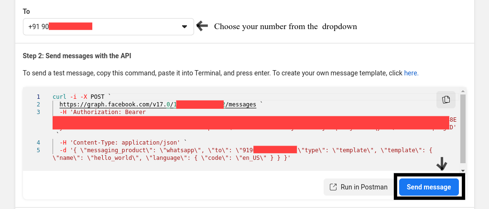
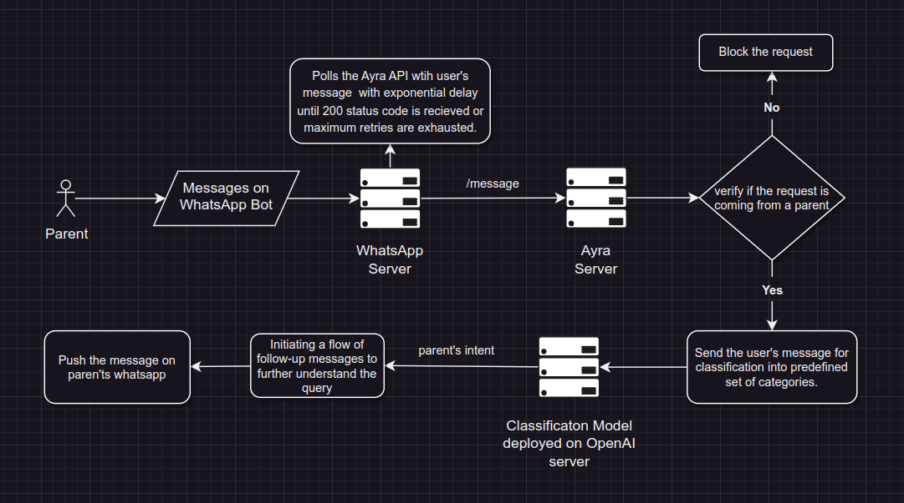
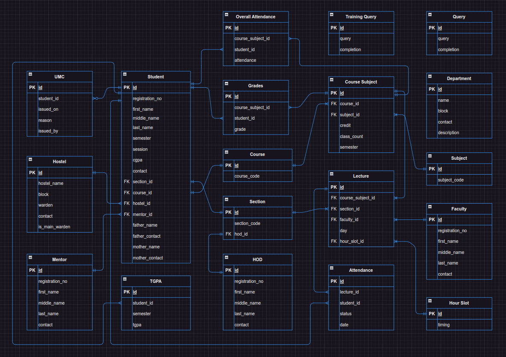
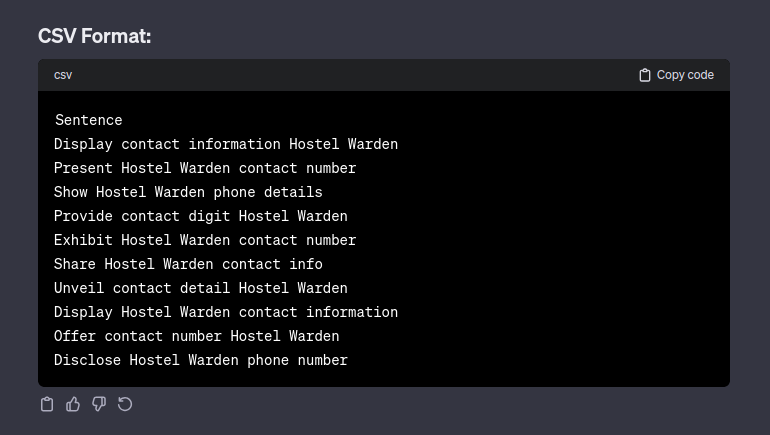

# Ayra 🤖


## 0. Table of Contents

1. [Overview](#1-overview)
2. [Install](#2-install)
   - [Requirements](#21-requirements)
   - [.env file](#22-env-file)
   - [Setting up locally](#23-setting-up-locally)
3. [Technical Walkthrough](#3-how-it-works)
   - [Overview](#31-general-overview)
   - [Database Design](#32-database-design)
   - [Classifier](#33-classifier)
   - [Infrastructure](#34-infrastructure)
4. [Future Ideas](#4-future-ideas)
5. [References](#5-references)

## 1. Overview

Ayra is a natural language language bot that lives in your WhatsApp. It assists parents of college students by offering an accessible and intuitive platform to monitor their child's performance and receive important updates from their institutions. Currently, the bot can communicate in English and Hinglish, but it only responds in English.

## 2. Install

### 2.1 Requirements

1. Node.js version 17+
2. Ngrok
3. PostgreSQL (if setting up locally)
4. [.env file](#22-env-file)

### 2.2 `.env` file

To setup this project locally, you’ll need a `.env` file with following set of variables.

```env
API_PORT=3000
API_URI=                   # Changes everytime the project starts locally.

META_API_URI=
META_VERIFY_TOKEN=         # Changes every 24 hours.
META_ACCESS_TOKEN=
META_PHONE_ID=

# OpenAI API
OPENAI_ACCESS_TOKEN=
OPENAI_MODEL_NAME=         # Name of the fine-tuned model

# Database
POSTGRES_HOST=
POSTGRES_PORT=
POSTGRES_DB_NAME=
POSTGRES_DB_USER=
POSTGRES_DB_PASSWORD=
```

Reach out to me via my [email](mailto:suyashpurwar4035@gmail.com) to get a copy of this file. `META_ACCESS_TOKEN` refreshes every 24 hours. So, you'll need access of the Meta for Developers dashboard too.

### 2.3 Setting up locally

1. **Clone the repository locally and move inside the folder.**

```bash
git clone https://github.com/Suyash-Purwar/ayra.git
cd ayra
```

2. **Put the `.env` file in the root directory of the project**

Get in touch with me to get the `.env` file by dropping a message at my [email](mailto:suyashpurwar4035@gmail.com). Two variables in the file wouldn't have any value. You'll need to generate the values of two variables - `META_ACCESS_TOKEN` and `API_URI`. Keep the rest of the variables as is.

3. **Set the value META_ACCESS_TOKEN**

Get the `Temporary Access Token` from the dashboard. Notice that it expires after a day. You'll be able to access the dashboard for this app once I provide the login credentials.


Copy the token and put in the `META_ACCESS_TOKEN` in the `.env` file like this.

```env
# In .env file
META_ACCESS_TOKEN=EAAS46vt...
```

4. **Setup HTTP tunnel**

Create an HTTP tunnel forwarding to to the local port on which the Ayra API is running (`API_PORT`).

Creating the tunnel without specifying the `region=us` fails at times. So, do add that parameter.

Run the following command in your terminal. Ngrok must be installed in your system for this to work.

```bash
ngrok http 3000 --region=us
```

You should see something like this after running the above command. The Forwarding URL (in the image below) is of special interest to us.


5. **Copy and paste the Forwarding URL in `API_URI` variable**

```env
# In .env file
API_URI=https://92db-112-196-62-6.ngrok-free.app
```

6. **Start the server**

```bash
npm run start:dev
```

If everything works perfectly, you should see the following logs.

```bash
API is running on PORT=3000. ✅
Executing (default): SELECT 1+1 AS result
Database connection established. ✅
```

7. **Verify the API url**

Go to the Meta for Developers dashboard. Click on the Configuration option button in the sidebar.


Press on the `Edit` button on the right side of the screen. A dialog box will open up. Replace the `API_URI` part with ngrok url obtained in the previous step. Keep the following `\webhook\receive` part as it is.

In the `.env` file, there's a variabled named `META_VERIFY_TOKEN`. Place it's value in the second input field. Press the `Verify and Save` button.


Upon successful verification, you should see a log like this in the terminal.

```bash
Webhook URL verified
```

8. **Install the bot on your WhatsApp**

Head over to the Meta for Developers dashboard and press on the `API Setup` option in the sidebar. Locate the following section and click on the `Manage phone number list` button.



After click the button, a popup will appear. Click on the `Add phone number` button to add your number and an OTP will be send to your WhatsApp to verify your contact.


After successful verification, close all the popups. Expand the dropdown and choose your number. Then press on the `Send message` button. This will install the bot on your WhatsApp.



This concludes the local installation setup. 🎊

## 3. Technical Walkthrough

### 3.1 Overview

Following I have described the all the steps undertaken to generate an appropriate response for the client. All the major steps are listed in order.

1. Parent pushes a message to the bot.
2. Whatsapp Server recieves this message and forwards it to the Ayra server.
3. When a request reaches the Ayra server, the first step is to verify if the contact number from which this message is from belongs to any parent or not. If no, the request is dropped. If yes, move to next step.
4. Once the user's request is authenticated, the message is fed to our AI model (deployed on OpenAI servers) which classifies the message into predefined sets of categories. In this process, we try to understand the intent behind the user's message.
5. According to the intent, a series of multiple-choice questions are asked to understand the parent's exact requirement.
6. Once that's understood, appropriate response is sent to the client (parent's whatsapp).

This whole procedure involves several database calls as well but were not mentioned explicitly everytime.



### 3.2 Database Design

I created a dummy database which mimics the database of an actual university to a certain degree. All the tables are populated with the dummy data.



### 3.3 Classifier

I fine-tuned the OpenAI's ada model for multi-class classification purpose. There was no training data available for this application. So, I wrote around 50 lines of traning data myself and used ChatGPT to extend this traning data by coming up with it's variations. Moreover, instructed it to make grammatical and spelling mistakes here and there so as to match the real world scenario.

Along with that, I instructed it to perform data processing tasks like lemmatization and removal of stop words. The quality of training data generated wasn't always upto the mark and I frequently had to intervene to modify the dataset.

The mighty prompt is below:

```text
Perform the following tasks sequentially on the given sentence.

1. Rephrase the sentences I'm giving you in ten different ways.
2. Perform lemmatization on every sentence.
3. Remove the stop words and punctuation from all the sentences.

Show the data in a CSV format with only one column

Sentence: Show the contact number of the Hostel Warden
```

Here's the sample output for the above prompt.



> More details coming soon...

### 3.4 Infrastructure

> Coming soon

## 4. Future Ideas

> Coming soon

## 5. References

> Coming soon
